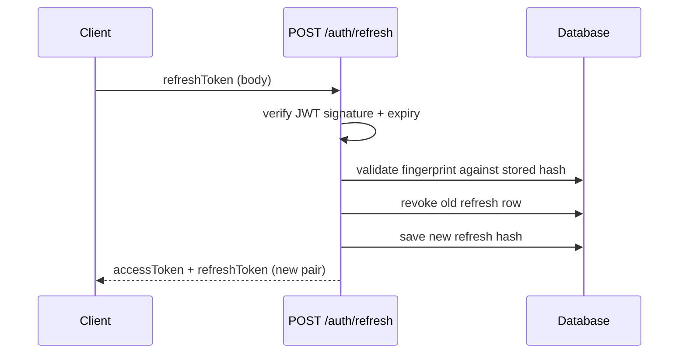

# HTTP API Reference

Base URL defaults to `http://localhost:3000`. JSON request and response bodies unless noted.

## Authentication

Protected routes expect a header:

```http
Authorization: Bearer <accessToken>
```

- **Access tokens** are JWTs signed with `JWT_SECRET`, expiring in **1 hour**. Payload includes `userId`, `email`, and `name`.
- **Refresh tokens** are JWTs signed with `REFRESH_SECRET`, expiring in **7 days**. Each refresh token is stored in the database as a **SHA-256 fingerprint** of the token, then **bcrypt-hashed** (cost 8) so long JWT strings are not truncated by bcrypt’s 72-byte input limit.

### Refresh flow



After a successful refresh, the previous refresh token is **revoked** and must not be reused.

---

## Endpoint reference

| Method | Path | Auth | Request body | Success | Errors |
|--------|------|------|----------------|---------|--------|
| GET | `/health` | No | — | `200` `{ status, timestamp }` | — |
| POST | `/auth/register` | No | `{ email, name, password }` | `201` user + tokens | `400` validation, `409` email exists |
| POST | `/auth/login` | No | `{ email, password }` | `200` user + tokens | `400` validation, `401` credentials |
| POST | `/auth/refresh` | No | `{ refreshToken }` | `200` new token pair | `400` validation, `401` invalid / revoked |
| POST | `/auth/logout` | Yes | `{ refreshToken }` | `204` | `400` validation, `401` access token |
| GET | `/campaigns` | Yes | — (query: `page`, `limit`) | `200` paginated list | `401` |
| POST | `/campaigns` | Yes | `{ name, subject, body, recipientIds? }` | `201` campaign | `400`, `401` |
| GET | `/campaigns/:id` | Yes | — | `200` campaign + `recipients` | `404`, `401` |
| GET | `/campaigns/:id/stats` | Yes | — | `200` stats object | `404`, `401` |
| PATCH | `/campaigns/:id` | Yes | `{ name?, subject?, body? }` | `200` campaign | `404`, `409` not draft, `401` |
| DELETE | `/campaigns/:id` | Yes | — | `204` | `404`, `409` not draft, `401` |
| POST | `/campaigns/:id/schedule` | Yes | `{ scheduled_at }` ISO datetime | `200` campaign | `400` past date, `404`, `409`, `401` |
| POST | `/campaigns/:id/send` | Yes | — | `202` `{ message }` | `404`, `409`, `401` |
| GET | `/recipients` | Yes | — | `200` `{ data }` | `401` |
| POST | `/recipients` | Yes | `{ email, name }` | `201` recipient | `400`, `409` duplicate email, `401` |

---

## Campaign status state machine

```
draft ──schedule──▶ scheduled ──send──▶ sending ──(async)──▶ sent
  │                     │
  └──send──▶ sending    └──(direct send from scheduled)
```

- **Edit / delete**: only when status is `draft` (`409` otherwise).
- **Schedule**: only from `draft`; `scheduled_at` must be strictly in the future (`400` if not).
- **Send**: allowed from `draft` or `scheduled`. Responds `202` immediately; processing sets `sending`, then `sent` when simulation completes.
- **Sending** is not reversible from the API; avoid deleting or editing in that state.

---

## Stats response (`GET /campaigns/:id/stats`)

| Field | Type | Meaning |
|-------|------|---------|
| `total` | number | Rows in `campaign_recipients` for the campaign |
| `sent` | number | Recipients with `status = 'sent'` |
| `failed` | number | Recipients with `status = 'failed'` |
| `opened` | number | Rows with non-null `opened_at` |
| `open_rate` | number | `opened / sent`, or `0` if `sent` is `0` (range 0–1) |
| `send_rate` | number | `sent / total`, or `0` if `total` is `0` (range 0–1) |

---

## Validation errors

`400` responses from `validate()` middleware use:

```json
{
  "error": "Validation failed",
  "details": { ... }
}
```

(`details` is Zod’s `flatten()` output.)
